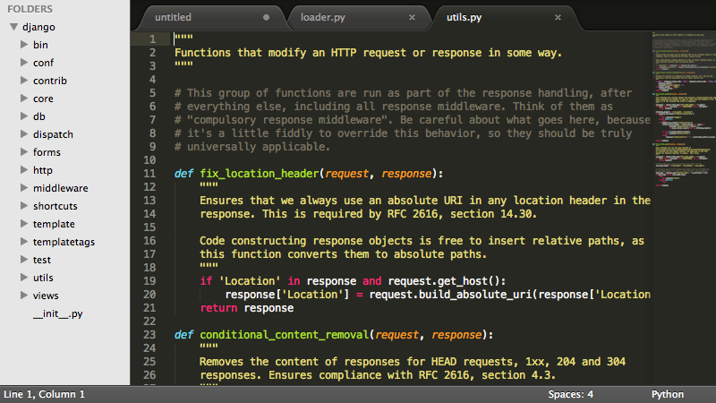

# web edit 사용하기
> 웹에디트란 웹개발에 필요한 에디트를 말한다.
즉, txt 문서를 활용하기에는 다소 어렵고 불편한 부분이 많기 때문에 해당 프로그래밍 언어개발을 위해
전용 에디트를 사용하고 있다.

## 웹용 에디트 알아보기
> 에디트는 매우 많은 종류가 있다.   
__디자이너__들이 즐겨쓰는 에디트들로는 
[서브라임텍스트](http://sublimetext.com), 
[브라켓](http://bracktes.io), 
[에디트플러스](http://www.editplus.com/kr), 
[노트패드](https://notepad-plus-plus.org), 
[드림위버](http://adobe.co.kr) 등이 있으며,  
__퍼블리셔/프론트앤드__ 분야에서는 위 에디트를 포함하여 
[아톰](http://atom.io), 
[웹스톰](https://www.jetbrains.com/webstorm/), 
[압타나](http://aptana.com) 등...   
__백엔드__ 및 기타 분야로는 
[이클립스](https://www.eclipse.org), 
[php스톰](https://www.jetbrains.com/phpstorm/), 
[파이참](https://www.jetbrains.com/pycharm/), 
[비주얼스튜디오](https://www.visualstudio.com/ko-kr/downloads/download-visual-studio-vs.aspx) 등이 있다.  
심지어 온라인이 발전함에 따라 __온라인으로 개발__이 가능한 에디트로
[클라우드나인](http://c9.io), 
[구름](https://www.goorm.io/), 
[코드펜](http://codepen.com) 등의 에디트도 출시되었다.  
사실 정확하게 어느분야에서 이런 프로그램을 사용한다 라는 것은 없다.  
쓰는 사람이 편하면 해당 에디트를 사용하여도 무관하다.
___
### 만인의 프로그램 서브라임텍스트
> 사실 서브라임텍스트는 유료프로그램이다.
하지만 후원의 개념으로 되어있어, 상업적용도가 아니라면 특별한 제한없이 무료로 사용이 가능하다
(사용중 후원해달라는 메세지를 무시할 수 있다면!!!!!)

>본 문서에서는 서브라임텍스트로 되어있다.   
(node.js 사용시의 npm의 개념이나 여러 유사한 개념을 쉽게 이해하기 위해!)

[ 서브라임텍스트 설치하러가기 http://sublimetext.com ](http://sublimetext.com)

___
### 디자이너의 편의성을 높인 브라켓
___
__[돌아가기](../README.md)__