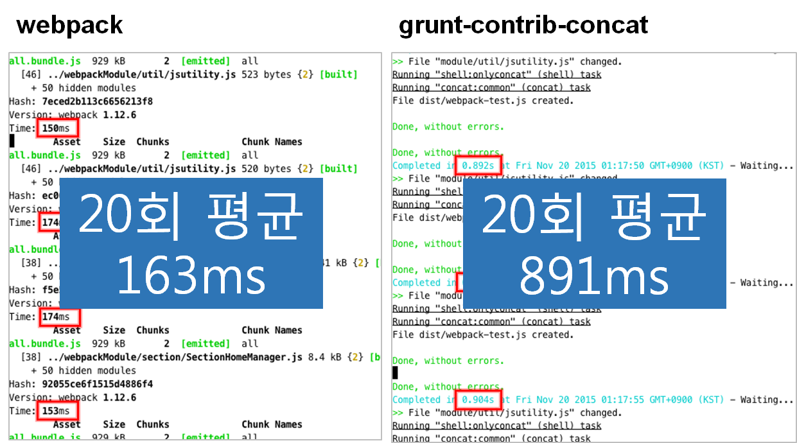
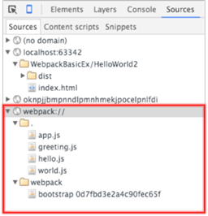
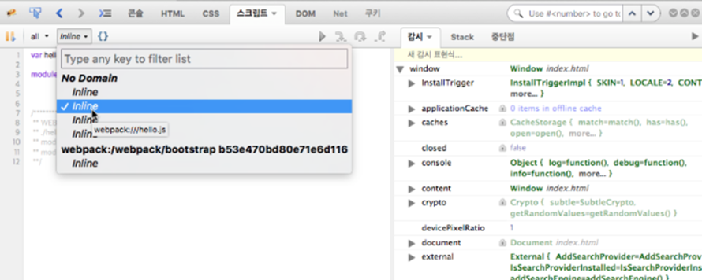

# javaScript 모듈화 도구, webpack

: 2016.02.12|13584  
>서버에서 처리하는 로직을 JavaScript로 구현하는 부분이 많아지면서 웹 서비스 개발에서 JavaScript로 작성하는 코드의 양도 늘어났습니다. 코드의 양이 많아지면 코드의 유지와 보수가 쉽도록 코드를 모듈로 나누어 관리하는 모듈 시스템이 필요해집니다. 그러나 JavaScript는 언어 자체가 지원하는 모듈 시스템이 없습니다. 이런 한계를 극복하려 여러 가지 도구를 활용하는데 그 도구 가운데 하나가 webpack입니다.

>webpack은 모듈 시스템을 구성하는 기능 외에도 로더 사용, 빠른 컴파일 속도 등 장점이 많습니다. 이 글에서는 webpack의 기능과 사용법을 간략하게 설명하고 webpack의 장점을 살펴보겠습니다.

## JavaScript 모듈 시스템과 webpack
이전부터 JavaScript에 모듈화 시스템을 적용하려는 많은 노력이 있었다. JavaScript 모듈화 명세를 만드는 대표적인 작업 그룹에 CommonJS와 AMD(Asynchronous Module Definition)가 있다.
webpack은 두 그룹의 명세를 모두 지원하는 JavaScript 모듈화 도구다.
> 참고
JavaScript 모듈화와 CommonJS, AMD에 관해서는 "JavaScript 표준을 위한 움직임: CommonJS와 AMD"를 참고한다.
조금 더 간결한 코드를 작성할 수 있는 CommonJS 명세로 작성한 예를 보며 webpack이 어떻게 JavaScript를 모듈화하는지 간략하게 살펴보겠다. AMD 명세로 작성한 예는 webpack 문서의 "AMD"에서 볼 수 있다.

## 모듈 정의와 모듈 사용
모듈을 작성하고 다음과 같이 module.exports 속성에 외부에 배포할 모듈을 전달해 모듈을 정의한다.  
~~~
module.exports = {message: 'webpack'};
~~~

모듈을 사용할 때는 모듈을 로딩하는 파일의 require() 함수에 로딩할 모듈의 경로를 전달한다. 다음 코드는 모듈을 정의하는 examplemodule.js 파일을 사용하는 예다.  
~~~
alert(require('./examplemodule).message);  
~~~

여러 모듈을 합치거나 중첩해서 모듈을 로딩할 수도 있다. 다음은 브라우저의 알림 메시지에 'HelloWorld'를 표시하는 예다. 'HelloWorld'를 구성하는 단어를 모듈로 분리한 다음 두 모듈을 합쳐서 사용한다.
'Hello'라는 메시지를 모듈로 만든 hello.js 파일은 다음과 같다.
~~~
module.exports = 'Hello';  
~~~

'World'라는 메시지를 모듈로 만든 world.js 파일은 다음과 같다.
~~~
module.exports = 'World';  
~~~

두 모듈을 합쳐 'HelloWorld'를 만드는 모듈인 greeting.js 파일은 다음과 같다.
~~~
var greeting = require('./hello') + require('./world');
module.exports = greeting;  
~~~

두 모듈을 합친 greeting 모듈을 로딩해 브라우저에서 경고 메시지가 나타나게 구현하는 app.js 파일은 다음과 같다.
~~~ 
alert(require('./greeting'));  
~~~
모듈을 정의하고 모듈을 사용하도록 로딩하는 방법은 어렵지 않다. 다만 모듈로 만든 파일은 바로 웹 페이지에 넣어 브라우저에서 실행할 수 없다. webpack으로 컴파일해 브라우저에서 실행할 수 있는 형태로 바꿔야 한다.

## webpack 사용 방법
webpack은 Node.js가 설치된 환경에서 실행된다. Node.js를 사용하는 환경에서 webpack을 설치하고 모듈을 컴파일하는 방법은 다음과 같다.

### 설치와 컴파일
webpack은 다음과 같이 npm 명령어로 설치할 수 있다.
~~~
npm install webpack -g  
~~~
webpack이 설치되면 다음 예와 같이 webpack {엔트리 파일 경로} {번들 파일 경로} 형식으로 명령어를 실행해 모듈을 컴파일한다.
~~~
webpack ./entry.js bundle.js  
~~~
엔트리 파일은 다음 그림과 같이 서로 의존 관계에 있는 다양한 모듈을 사용하는 시작점이 되는 파일이다. 번들 파일은 브라우저에서 실행할 수 있게 모듈을 컴파일한 파일이다.
webpack에서 컴파일은 엔트리 파일을 시작으로 의존 관계에 있는 모듈을 엮어서 하나의 번들 파일을 만드는 작업이다. JavaScript를 사용하는 HTML 코드에서는 컴파일 결과로 만들어진 번들 파일만 포함하면 된다.

엔트리 파일이 여러 개일 때는 엔트리 파일마다 번들 파일이 생성된다.

컴파일 명령어에 --watch 옵션을 사용하면 모듈 파일이 변경될 때마다 변경된 모듈을 자동으로 다시 컴파일한다.
webpack --watch ./entry.js bundle.js  

### 모듈의 스코프
컴파일 과정에서 각 모듈은 함수로 감싸진다. 예를 들어 다음 코드에서 greeting 변수는 전역 변수지만 webpack으로 모듈이 컴파일된 뒤에는 지역 변수가 된다.
~~~
var greeting = require('./hello') + require('./world');
module.exports = greeting; 
~~~

다음은 위의 모듈을 컴파일해서 생성된 번들 파일의 내용이다. 모듈을 작성할 때 모듈의 변수가 전역 변수가 되는 것을 피하려 함수로 변수를 감쌀 필요가 없다.
~~~
/* 1 */
/***/ function(module, exports, __webpack_require__) {
    var greeting = __webpack_require__(2) + __webpack_require__(3);
    module.exports = greeting;

/***/ },
~~~
### 설정 파일 사용
CLI(command line interface)로 webpack을 실행해 컴파일할 때 엔트리 파일이 많거나 옵션이 많으면 입력하기 불편하다. 설정 파일을 만들어 컴파일하면 이런 불편을 줄일 수 있다.
webpack 설정 파일의 기본 형태는 다음과 같다.
~~~
module.exports = {  
    context: __dirname + '/app', // 모듈 파일 폴더
    entry: { // 엔트리 파일 목록
        app: './app.js' 
    },
    output: {
        path: __dirname + '/dist', // 번들 파일 폴더
        filename: '[name].bundle.js' // 번들 파일 이름 규칙
    }
}
~~~
위와 같은 형태로 webpack.config.js 파일을 작성해 저장한다. 설정 파일이 있는 디렉터리에서 다음과 같이 간단하게 명령어를 입력하면 컴파일을 실행한다.
### webpack  
--watch 옵션으로 변경 사항을 자동으로 반영하려 할 때도 다음과 같이 간단한 명령어만 입력하면 된다.
~~~
webpack --watch  
~~~
webpack을 사용할 때는 다양한 설정을 함께 사용하는 경우가 대부분이라 설정 파일로 컴파일하는 사례가 많다. 더 다양한 설정 옵션과 자세한 설명은 webpack 문서의 "Configruation"에서 확인할 수 있다.
### 로더
webpack의 로더는 다양한 리소스를 JavaScript에서 바로 사용할 수 있는 형태로 로딩하는 기능이다. 로더는 webpack의 특징적인 기능이면서 webpack을 강력한 도구로 만드는 기능이다.
다음 그림과 같이 로더의 종류에 따라 JavaScript에서 사용할 수 있는 다양한 형태의 결과를 얻을 수 있다.

템플릿 라이브러리인 handlebars를 로딩하는 로더인 handlebars-loader를 사용하는 예를 보며 로더를 사용하는 방법을 알아보겠다.
handlebars 라이브러리가 설치된 환경에서 다음과 같이 npm 명령어를 실행해 handlebars-loader를 설치한다.
npm install handlebars-loader  
로더가 설치되면 webpack.config.js 파일에 다음과 같이 로더 관련 설정을 추가한다.
~~~
module.exports = {  
    ...
    output : {
        ...
    },
    module : {
        loaders : [
        // 적용할 파일의 패턴(정규표현식)과 적용할 로더 설정
        {
            test : /\-tpl.html$/,
            loader : 'handlebars'
        }]
    }
}
~~~
사용할 템플릿 파일(example-tpl.html)의 예는 다음과 같다.
~~~

{{greeting}}
  
~~~
템플릿을 사용하는 모듈의 내용은 다음과 같이 작성할 수 있다. require() 함수로 템플릿 파일을 로딩한 결과는 handlebars.compile() 함수를 거쳐 반환된 결과라 바로 데이터를 주입해 데이터와 결합된 HTML 코드를 얻을 수 있다.

~~~
var listTpl = require('./example-tpl.html');  
listTpl( { greeting: 'Hello World' } );  
~~~
handlebars-loader를 활용하면 템플릿 파일을 별도의 HTML 파일로 관리할 수 있어 유지와 보수가 쉬워진다.
webpack의 로더는 handlebars 외에 많은 라이브러리를 지원하기 때문에 활용 범위가 매우 넓은 기능이다. 로더를 활용하면, Facebook의 라이브러리인 React의 JSX 형식도 사용할 수 있고, ECMAScript 2015를 사용할 수 있게 컴파일하는 Babel도 사용할 수 있다. webpack이 지원하는 로더는 webpack 문서의 "list of loaders"에서 확인할 수 있다.
### 컴파일 성능
webpack을 사용하면 코드를 수정할 때마다 컴파일을 실행해야 수정한 코드가 적용된 결과를 바로바로 확인할 수 있다. --watch 옵션을 적용하면 변경된 내용이 있을 때마다 자동으로 컴파일할 수 있다. 하지만 작성하는 JavaScript 파일의 개수가 많은 실제 프로젝트에서 --watch 옵션을 적용한 webpack의 컴파일 성능이 얼마나 좋을지 의심됐다.
현재 사용 중인 grunt-contrib-concat와 컴파일 성능을 비교해 봤다. 테스트 대상 파일의 개수는 48개고, 전체 코드의 양은 약 10,194줄이다. 20회씩 컴파일한 결과는 다음과 같다.

webpack의 20회 평균 컴파일 시간은 163밀리초고, grunt-contrib-concat의 20회 평균 컴파일 시간은 891밀리초다. 테스트 전에는 단순히 파일을 병합하기만 하는 grunt-contrib-concat의 컴파일 속도가 더 빠를 것으로 예상했다. 하지만 예상과 달리 webpack의 컴파일 속도가 더 빨랐다. webpack 공식 문서의 다음 내용에 따르면 webpack이 비동기 I/O와 다중 캐시 레벨을 사용하기 때문에 컴파일 속도가 매우 빠르다고 한다.
~~~
webpack uses async I/O and has multiple caching levels. This makes webpack fast and incredibly fast on incremental compilation.
~~~

### 개발자 도구 연동
webpack을 사용할 때 브라우저에서 실행되는 코드는 실제 작성한 코드가 아니라 webpack으로 컴파일된 코드다. 모듈 시스템 적용을 위한 부가적인 코드 외에는 작성할 때의 코드가 거의 그대로 컴파일된 코드에 반영돼기 때문에 디버깅하는 데 어려움은 없다. 하지만 컴파일 이후에는 엔트리 파일의 개수에 따라 하나나 여러 개의 파일로 모듈이 병합되기 때문에 코드를 작성할 때의 파일 구조를 파악해서 디버깅해야 할 때는 어려움이 있을 수 있다.
webpack의 소스 맵 설정을 사용하면 컴파일된 파일에서도 원래의 파일 구조를 확인할 수 있다. 설정 파일(webpack.config.js)에 다음과 같이 한 줄을 추가하고 컴파일한다.
~~~
module.exports = {  
    ... 
    devtool: '#inline-source-map'
}
~~~
브라우저에서 웹 페이지를 다시 열고 개발자 도구를 실행하면 코드를 작성할 때의 파일 구조를 볼 수 있고 실제 작성한 코드에 접근할 수 있다. 다음 그림은 Chrome의 개발자 도구를 실행한 화면이다. webpack:// 도메인 아래에 모듈을 구성하는 파일의 구조가 나타난다.

Firefox에서는 Firebug를 설치해 webpack의 소스 맵 기능을 사용할 수 있다.

### 빌드 도구 연동
webpack은 빌드 도구에서 사용할 수 있는 플러그인도 제공한다. 널리 쓰는 빌드 도구인 Grunt와 Gulp를 위한 webpack 플러그인은 다음과 같다.
~~~
grunt-webpack
gulp-webpack
~~~
webpack이 제공하는 빌드 기능(압축, 난독화, 소스 파일 병합)만으로도 충분하다면 빌드 도구와 연동하지 않고 webpack만 단독으로 사용해도 된다.
### 마치며
webpack을 사용해 JavaScript를 모듈로 관리하는 방법을 간략하게 살펴봤다. webpack을 사용하며 느낀 장점을 정리하면 다음과 같다.
- 편리한 모듈 의존성 관리
- 로더를 활용한 다양한 리소스의 효율적인 활용
- 빠른 컴파일 속도
- 잘 정리된 문서(http://webpack.github.io/docs/)
특히 로더는 다양한 리소스와 함께 개발하는 JavaScript 개발 환경에서 활용 범위가 매우 넓다고 할 수 있다.
webpack은 Airbnb, Flipboard, Pinterest 등 실제 여러 회사에서 사용하고 있다(더 많은 사용 사례는 http://stackshare.io/webpack를 참고한다).   
더 나은 JavaScript 개발 환경에 대해 고민하고 있는 분들께 이 글이 조금이나마 도움이 되면 좋겠다.