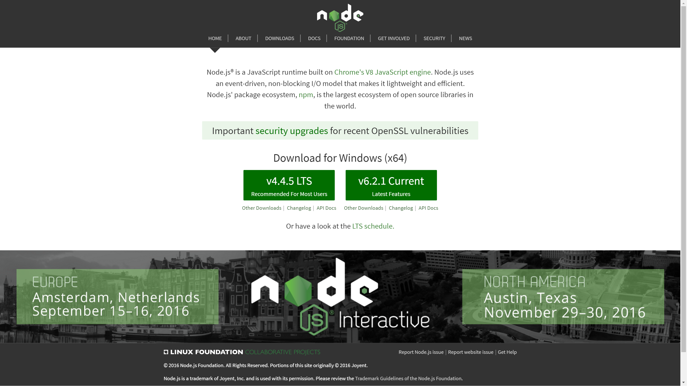
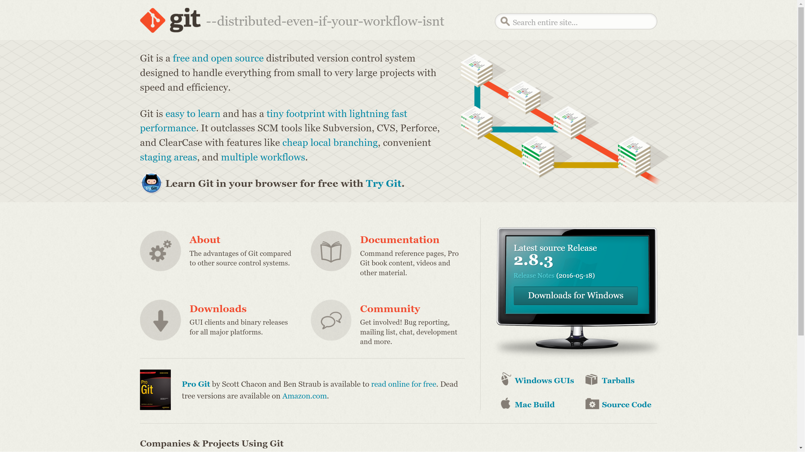
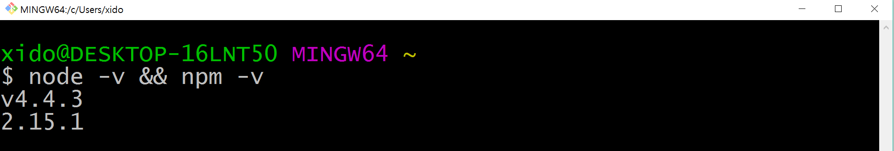
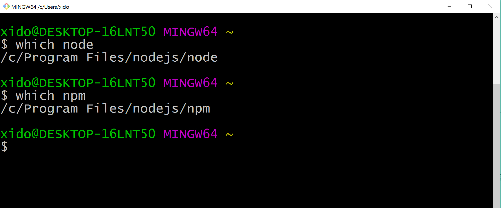

<!--background : #ffcc00-->

# node.js란?
> 자바스크립트를 개발언어로 사용하는 소프트웨어 플랫폼으로서  
크롬웹브라우저/안드로이드에 탑재된 V8엔진위에서 동작한다.  
자바스크립트 기반으로 되어있지만, 서버측에서 실행되는 서버 사이드 언어이다.  

## 설치하기(node.js &amp; Git bash)

__[node.js 사이트이동하기](https://nodejs.org)__  

1. 사이트에서 왼쪽 lts버전을 다운받아 설치한다. (사용하는 os마다 조금씩 다름)
2. node를 설치하면 npm(노드JS로 만들어진 모듈을 웹에서 받아서 설치하고 관리해주는 프로그램)이 같이 설치된다.   
   

__[git 사이트이동하기](https://git-scm.com)__

1. 오른쪽 하단 모니터그림을 클릭하여 프로그램을 설치한다. (사용하는 os마다 조금씩 다름)
1. __윈도우__사용자의 경우 cmd모드로 사용이 가능하지만 일부 기능의 제한이 있기에 mac과 맞추기위해 git프로그램을 설치하고, 
gitbash를 실행해서 사용한다.
1. __맥__사용자의 경우 터미널을 켜서 사용이 가능  

## 설치 확인하기
1. node.js와 npm이 올바르게 설치되어 있는지 확인해보자!
( __npm__이란 node패키지를 관리하는 모듈이라고하며, 쉽게말해서 node.js를 사용시 편리하게 도와주는 기능을 관리하는 도구이다. )
1. 터미널 또는 gitbash를 실행한 후 node --v &amp;&amp; npm --v 입력 후 엔터키를 누른다. (버전을 확인할 수 있다.)

1. 이번에는 which node, 
which npm을 각각 입력해서 설치 위치를 확인해보자!  

1. 각각 c:// Program Files/ nodejs 폴더에 설치된것을 알 수 있다.

___
__[돌아가기](../README.md)__